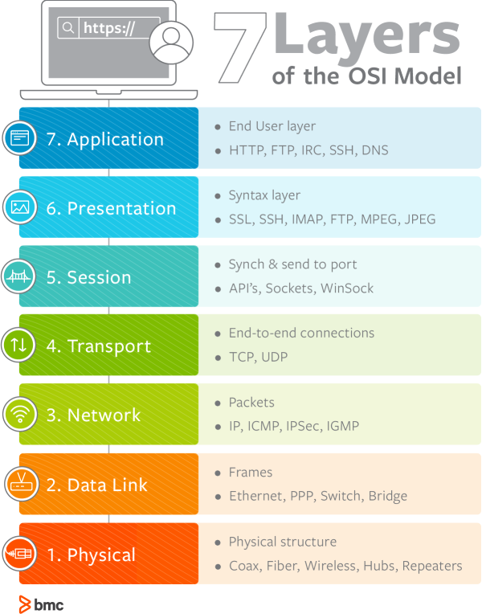

# CS

## OSI 7계층

---

### 💡 OSI 7계층이란?

OSI 7계층은 네트워크에서 통신이 일어나는 과정을 7단계로 나눈 것

 

### ✨ OSI 7계층 모델

 

### ✨ TCP/IP 4계층 모델과의 차이

| OSI 7계층 | TCP/IP 4계층 |
| --- | --- |
| 응용, 표현, 세션 | 응용 |
| 전송 | 전송 |
| 네트워크 | 인터넷 |
| 데이터 링크, 물리 | 네트워크 |

 

### 1. 물리 계층

- 리피터, 케이블, 허브 등
- 전송 단위: Bit
- 데이터를 전송하는 역할을 한다.

### 2. 데이터 링크 계층

- 브릿지, 스위치, 랜카드 등
- 전송 단위: Frame
- Mac 주소를 통해 통신한다.
- 네트워크 계층에서 받은 정보에 주소와 제어 정보를 헤더와 테일에 추가한다.
- 에러 검출, 재전송, 흐름제어를 한다.

### 3. 네트워크 계층

- 라우터, L3 스위치
- 전송 단위: Packet,
- IP 주소를 통해 통신한다.
- 상위 계층의 데이터를 작은 크기의 패킷으로 분할하여 해당 경로에 따라 전달한다.
- 데이터를 목적지까지 가장 안전하고 빠르게 전달하는 기능을 담당한다.
- 라우팅, 흐름 제어, 오류 제어, 세그멘테이션 등을 수행한다.

### 4. 전송 계층

- 대표적인 프로토콜로 TCP (신뢰성, 연결 지향적), UDP(비신뢰성, 비연결성, 실시간)가 있다.
- 전송 단위: Segment
- Port 번호를 통해 통신한다.
- 상위 프로토콜을 구분하고 패킷의 순서와 손상을 보장한다.
- 송신 컴퓨터의 응용 프로그램서 수신 컴퓨터의 응용 프로그램까지의 메시지 오류 복구와 흐름 제어를 관리한다.

### 5. 세션 계층

- API, Socket
- 전송 단위: Message
- 데이터가 통신하기 위한 논리적 연결을 담당한다.
- TCP/IP 세션을 만들고 없애는 책임을 가지고 있다.

### 6.  표현 계층

- JPEG, MPEG 등
- 전송 단위: Message
- 데이터 표현에 대한 독립성을 제공하고 암호화하는 역할을 담당한다.
- 파일 인코딩, 명령어를 포장, 압축, 암호화한다.

### 7. 응용 계층

- HTTP, FTP, DNS
- 전송 단위: Message
- 사용자와 가장 밀접한 계층으로 인터페이스 역할을 한다.
- 전자 우편, 데이터베이스 관리 등의 서비스를 제공한다.

 

---

참고
 
1. [https://gyoogle.dev/blog/computer-science/network/OSI 7계층.html](https://gyoogle.dev/blog/computer-science/network/OSI%207%EA%B3%84%EC%B8%B5.html)
 
2. [https://blog.naver.com/PostView.nhn?blogId=tmk0429&logNo=222294381124](https://blog.naver.com/PostView.nhn?blogId=tmk0429&logNo=222294381124)
 
3. [https://hahahoho5915.tistory.com/15](https://hahahoho5915.tistory.com/15)